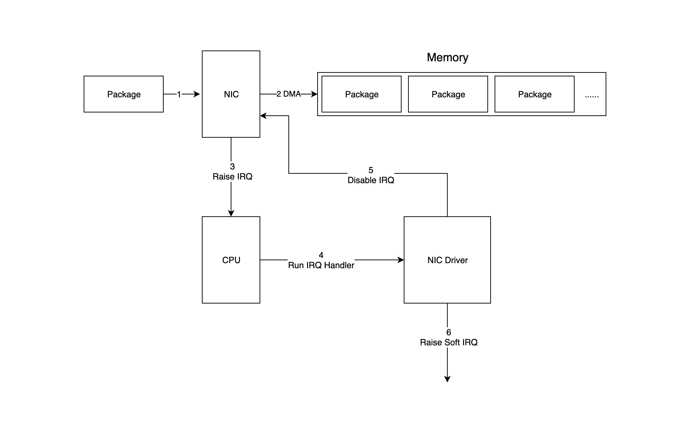

# Linux Networking 

In this article i'm currently trying to learn most of the in's and out's of networking in linux. From the driver loaded in the kernel all the way up to a TCP packet. My interest comes from my passion to understand how my system REALLY works. That may sound quite exaggerated , and it is...but nonetheless I love to strive to understand what my system is currently doing to use the most revolutionary system humans have done with computers ( besides quantum computing , but that's another topic for another time ;)  ). 

Anywho , these are my random notes and scribblings while trying to climb further down the Linux rabbit hole.

---

# NIC to Memory 

The NIC has a driver that allows it to communicate with the kernel. This acts as a glue between the linux networking stack and the physical network device. 

When the physical device receives a packet,  its driver receives an interrupt , the interrupt handler for this is the very driver mentioned earlier. 

Here is a diagram of what a packet looks like from memory to the NIC driver. 

