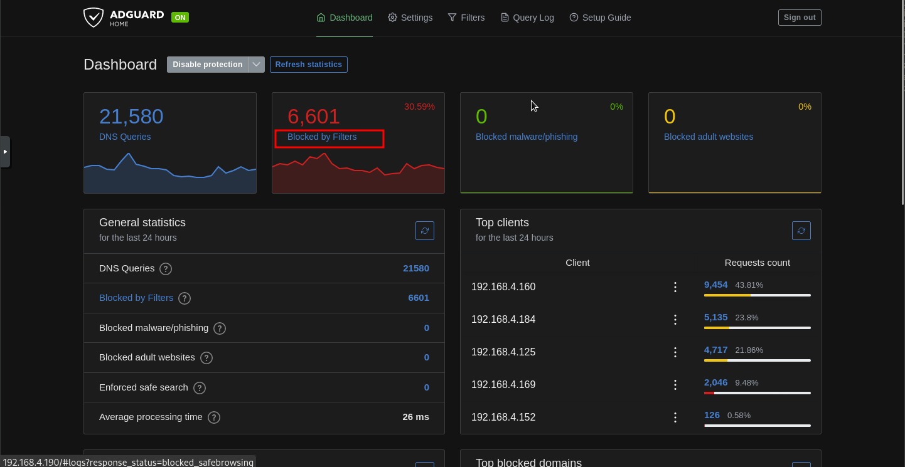
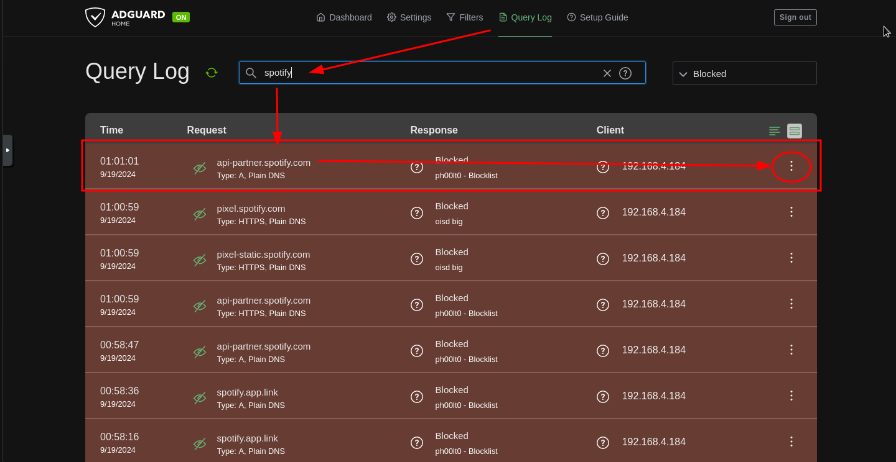
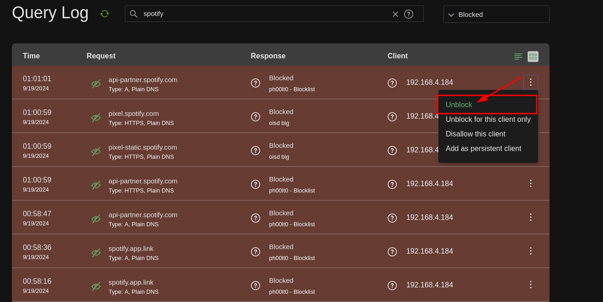

# Linux notes for reference

In this document I have added various bash snippets ,tips , and other useful pieces of knowledge that might help me navigate the insane POWAH of linux.

---

# Table of contents 

- [Command & Bash snippets](#command--bash-snippets)
- [System Tools and 3rd party utilities command snippets](#system-tools-and-3rd-party-utilities-command-snippets)
    - [Xinitrc](#xinitrc)
    - [Tips & tricks](#tips--tricks)
    - [ProtonVPN connections](#protonvpn-connections)
    - [Setting up torrent server vm](#setting-up-torrent-server-vm)
    - [Redirect both STDOUT and STDERR](#redirect-both-stdout-and-stderr)
    - [Piping](#piping)
    - [Tar snippets](#tar-snippets)
    - [Systemd](#systemd)
    - [Rc.local](#rclocal)
    - [systemd unit file](#systemd-unit-file)
    - [Crontab](#crontab)
    - [init.d](#initd)
    - [chkconfig: 345 99 10](#chkconfig-345-99-10)
    - [xrandr](#xrandr)
    - [move monitor to the right of another](#move-monitor-to-the-right-of-another)
    - [change refresh rate of monitor](#change-refresh-rate-of-monitor)
    - [Change background picture with feh](#change-background-picture-with-feh)
    - [bash difference between $() and ${}](#bash-difference-between--and-)
    - [use find to only list dotfiles](#use-find-to-only-list-dotfiles)
    - [Change extensions of all files in dir](#change-extensions-of-all-files-in-dir)
    - [add text to specific line with sed](#add-text-to-specific-line-with-sed)
    - [nmcli & Networking](#nmcli--networking)
    - [SELinux](#selinux)
    - [DNF](#dnf)
    - [Adguard Home](#adguard-home)
    - [Firewalld](#firewalld)
    - [NFS](#nfs)
    - [NTP](#ntp)
    - [Podman](#podman)
    - [GRUB](#grub)
    - [User management](#user-management)
    - [Package management with DNF](#package-management-with-dnf)
    - [Logical Volume Management](#logical-volume-management)
    - [Stratis](#stratis)
    - [CIFS](#cifs)
    - [NMAP](#nmap)
    - [GRUB](#grub-1)
    - [Common errors and small fixes](#common-errors-and-small-fixes)
    - [Docker](#docker)
    - [Sed](#sed)
    - [Oracle SBC](#oracle-sbc)
    - [TrueNAS](#truenas)
    - [Grep](#grep)
    - [Find](#find)
    - [System Clipboard](#system-clipboard)
    - [Tar](#tar)
    - [Unzip](#unzip)
    - [Display Management](#display-management)
    - [Git](#git)
    - [Xorg](#xorg)
    - [Rclone](#rclone)
    - [Du](#du)
    - [Ranger](#ranger)
    - [Markdown](#markdown)
    - [Youtube downloading](#youtube-downloading)
    - [FHS](#fhs)
        - [/home](#home)


## Command & Bash snippets 

### Symbolic and hard links 

The best information can be found on the man page. Use man ln for further details. However, to avoid confusion, please note that the syntax is as follows: "TARGET" should be the file or directory for which you would like to create a link, while "LINK\_NAME" is the name and directory where the link will appear in the specified absolute file path. It should be noted that "TARGET" should be an absolute path to the item you want to link. However, you can use relative paths for "LINK\_NAME" if you wish. Nonetheless, I prefer using absolute paths for both to avoid making mistakes, such as misplacing the link on my system.

```bash
ln -s TARGET LINK_NAME 
```
#### Create symbolic link to file

```bash
$ ln -s /home/ryan/something.py /opt/scripts/something.py
```
**create directory with a timestamp as it's name**

> Use the following command below in a bash script 
>
> ```bash
> timestamp=$(date +"%Y-%m-%d_%H-%M-%S")
> ```
>
> Then to make the directory , use the following syntax 
> ```bash
mkdir "directory_$(date +%Y%m%d_%H%M%S)"
```

**enable vi keybinds for bash**

```bash
set -o vi 
```

**find bash shortcuts**

```bash
man readline
```

**Remove file with hyphens in the name**

```bash
rm -- -filename
```

or 

```bash
rm ./--filename
```

**Start comand as background job**

```bash
command &
```

Add an ampersand at the end of the command 

Type jobs to view your background tasks

use ```bash
fg 
``` by itself to bring the most recently started background job to the foreground of the console. From there you can stop the job using Ctrl-Z or Ctrl-C

**Change file extension of all files in directory**

```bash
rename 's/\.foo$/.bar/' *.foo
```

replace foo with the current extension , replace bar with the new ext.


**Show keycode for keybind**

If you're using Xorg as your display server, xev should already be installed. This tool let's you see what keycode goes to what key.

```bash
xev
``` 

After finding the keycode, run this command below. Substitute \<KEYCODE\> with the numerical keycode you retrieve from xev.

```bash
xmodmap -pk | grep <KEYCODE>
```

**Show info about hard drives connected**

```bash
find /dev/disk/by-id/ -type l|xargs -I{} ls -l {}|grep -v -E '[0-9]$' |sort -k11|cut -d' ' -f9,10,11,12
```

**Show otherboard info**

```bash
dmidecode -t 2 
```

**Disable trackpad on linux**

```bash
sudo apt-get install xinput 
```

then find your touchpad with ```bash
xinput list
```. Alot of the time trackpads are labeled with "SynPS/x Snynaptics TouchPad". Locate the ID in the second column and do the following command below.

```bash
xinput --disable <ID>
```


**List all users on host**

```bash
compgen -u | column
```


**Restore default .bashrc, .profile**

The default versions of these files are stored in 

```bash
/etc/skel/
```


**To restore these files**

```bash
source /etc/skel/.bashrc
```

or 

```bash
source /etc/skel/.profile
```

or 

```bash
source /etc/skel/.bash_logout
```


**Show motherboard info**

```bash
dmidecode | less
```


**Get CPU info** 

```bash
lscpu
```

or 

```bash
cat /proc/cpuinfo
```


**Get disk info**

```bash
lsblk -o +MODEL,SERIAL,WWN
```

or 

```bash
ls -l /dev/disk/by-id
```

or 

```bash
lsblk |awk 'NR==1{print $0" DEVICE-ID(S)"}NR>1{dev=$1;printf $0" ";system("find /dev/disk/by-id -lname \"*"dev"\" -printf \" %p\"");print "";}'|grep -v -E 'part|lvm'
```


**Reduce text entering sensitivity**

You can either use kbdrate or xset , preferably xset as it works alot easier 

Enter this line in your xinitrc , or just copy the xinitrc from the ~/dotfiles directory to your local .xinitrc

```bash
xset r rate 250 60
```


This will reduce the sensitivity 


# System Tools and 3rd party utilities command snippets

The below section should include tools and snippets from various tools i've used.

# Xinitrc 

the xinitrc file is used for loading additional configurations and settings when the Xorg server starts 


**Manually disable the caps lock ( lock , not the button itself)**

**Install numlockx and run this command**

```bash
python -c 'from ctypes import *; X11 = cdll.LoadLibrary("libX11.so.6"); display = X11.XOpenDisplay(None); X11.XkbLockModifiers(display, c_uint(0x0100), c_uint(2), c_uint(0)); X11.XCloseDisplay(display)'
```


**Add aliases for ssh connections**

Add two lines for each host , one being the IP and the port you want to use 

```bash
vim ~/.ssh/config 
```

Add these two lines to the ~/.ssh/config file 

> Host xxx.xxx.x.x

> Port xxx


Then add the IP addresses for the ssh hosts to the /etc/hosts file with the format below 

```bash
IPADDR     hostname
```


**Create swap file**

**step 1 : use dd to create the file using the /dev/zero device**

```bash
dd if=/dev/zero of=/swapfile bs=1M count=100
```

**step 2 : convert file to swapfile**

```bash
mkswap /swapfile
```

**step 3 : swap to the newly created swap file**

```bash
swapon /swapfile
```

**step 4 : mount the file in /etc/fstab**

Add this line to the bottom of your /etc/fstab file 

```bash
/swapfile none swap defaults 0 0
```

This will mount the swap file automatically after boot 

--- 


# Tips & tricks 

Below is some useful info for different services and how they can be enabled / modified.

**Installing Network Manager on Debian 12**

One of the issues while installing NetworkManager lies with a preset network configuration by the system. Specifically the file /etc/network/interfaces is configured automatically and for some reason if this is present you will see an error in STDERR when installing asking you to remove the configuration if you want to use Network manager to manage any connections.


Simply delete all lines in /etc/network/interfaces and re-install the package and the systemd service file should be present and should allow you  to activate it. 

# ProtonVPN connections 

Change the file extension to a .conf file , then copy the file over to /etc/openvpn. This will start a daemon for every connection in the directory 

---

# Setting up torrent server vm 

Put ovpn file in /etc/openvpn 

install openvpn-systemd-resolved and network manager

---

# Redirect both STDOUT and STDERR 

```bash
command &> /dev/null
```

or 

```bash
command > /dev/null 2>&1
```

---


# Piping 

> 0> = STDIN
>
> 1> = STDOUT 
> 
> &> = STDOUT & STDERR
> 
> 2> = STDERR


---


# tar snippets 

**List contents of archive**

```bash
tar -tf archive.tar
```

**Add file to archive**

```bash
tar -rf backup.tar file
```

**Backup entire system with timestamp**

Note : it's a good idea to exclude sys, mnt , and proc as they can cause a backup to freeze. None of these directories should be necessary for archival anyways 

```bash
tar pzvxf --exclude=mnt/ --exclude=sys/ --exclude=proc/ /backup/"$(date '+%Y-%m-%d').tar.gz" --one-file-system /
```

**add timestamp to tar archive**

```bash
tar -zcvf "$(date '+%Y-%m-%d').tar.gz" 
```


---

# Systemd 

**disable unit**

> Stop the service 
>
> ```bash
> systemctl stop <unit-name> 
> ```
> 
> Disable the service :
>
> ```bash
> systemctl disable <unit-name>
> ```
>
> Stop the unit from being started manually or automatically 
>
> ```bash
> systemctl mask <unit-name>
> ```
>

**Systemd timer unit template**

Create this unit alongside the existing service unit in the same directory 

```bash
[Unit]
Description=Runs My Service every hour

[Timer]
OnBootSec=10min
OnUnitActiveSec=1h
Unit=my-service.service

[Install]
WantedBy=timers.target

```

**Creating service files that involve X org server**

> If you need to create a service that depends upon an X server running , add this line under the "Unit" section 

```bash
PartOf=graphical-session.target
```

> Also you will want to add this line under the "Install" section 

```bash
WantedBy=xsession.target
```

**Boot into different target**

```bash
cd /usr/lib/systemd/system
```

```bash
grep Isolate *.target
```

Decide which target you would like to use , then run systemctl isolate 

```bash
systemctl isolate something.target
```

**Start systemd service under specific User ID**

```bash
systemctl --user service.name
```

**Change user systemd service to start on system startup**

```bash
loginctl enable-linger myuser
```

**Running scripts at startup**

There are many ways to do this , assuming you are using systemd. You can use the following methods to run a script on boot.

### Rc.local

add this line in the /etc/rc.d/rc.local file 

```bash
sh /home/user/scriptdir/script.sh
```

### systemd unit file 

Use the template below for your script , put this inside */etc/systemd/system*

```bash
[Unit]
Description=Reboot message systemd service.

[Service]
Type=simple
ExecStart=/bin/bash /home/ec2-user/reboot_message.sh

[Install]
WantedBy=multi-user.target
```

Set perms for the service file 

```bash
chmod 644 /etc/systemd/system/script.service 
```

Then enable the service file in systemd 

```bash
systemctl enable script.service 
```


### Crontab 

edit the crontab file 

```bash
crontab -e 
```

To run the script on reboot, use the template below 

```bash
@reboot sh /home/user/reboot_message.sh
```

**WARNING : Not all versions of cron support the '@reboot' option**

### init.d 

Make a script and put it in /etc/init.d/

Use the template below : 

```bash
! /bin/sh
# chkconfig: 345 99 10
case "$1" in
  start)
    # Executes our script
    sudo sh /home/user/script.sh
    ;;
  *)
    ;;
esac
exit 0
```

---

# xrandr 

Put xrandr configurations in ~/.xprofile 


### move monitor to the right of another 

```bash
xrandr --output <DISPLAY-OUTPUT-1> --right-of <DISPLAY-TWO-2> 
```


### change refresh rate of monitor 

```bash
xrandr --output <DISPLAY-OUTPUT> --mode <DISPLAY-RESOLUTION> --rate <REF-RATE> 
```

Put this line in the ~/.xprofile file for configuration on startup ( happens late in the boot process ) 


## Change background picture with feh 

create a ~/.fehbg file with your feh command 

```bash
feh --bg-fill /home/user/something.jpg
```

Then put this line in your ~/.xinitrc file 

```bash
~/.fehbg &
```

## bash difference between $() and ${}

"${}" :
- used for referencing variables in a script 

```bash
echo ${var} something
```

"$()" : 
- used for running commands in a subshell 

```bash
echo "Path $(basename /home/user/Downloads)
```


## use find to only list dotfiles 

```bash
find . -maxdepth 1 -type f -name ".*" 
```


## Change extensions of all files in dir

```bash
find . -name '*.txt' -exec sh -c 'mv "$0" "${0%.txt}.txt_bak"' {} \;
```

Replace .txt with the current ext and replace .txt_bak with the ext you are trying to set it to 


## add text to specific line with sed 

For this example I wanted to update a bunch of openvpn config files to change only one line , being the 'auth-user-pass' and put in the location where my creds are stored 

Below is the command I used 

```bash
sed -e '/auth-user-pass/ s/$/ \/opt\/scripts\/login.conf/' ./*
```


# nmcli & Networking 

**show all open net conns**

```bash
sudo netstat -nlp
```

**show service being used by specific port**

Shows services using port 80 

```bash
lsof -i tcp:80
```

**Remove Secondary IP for host**

```bash
nmcli con mod <con-name> -ipv4.addresses "<IP>" 
```
**Add Wifi Connection**

```bash
nmcli device wifi connect <AP name> password <password>
```

**Create new network connection in nmcli**

```bash
nmcli con add con-name static ifname ens18 autoconnect no type ethernet ip4 10.0.0.10/24 gw4 10.0.0.1 ipv4.method manual
```


**Bring up network connection with nmcli**

```bash
nmcli con up <con-name> 
```


**Switch to DHCP with nmcli**

```bash
nmcli con up dhcp
```


**change connection to not connect automatically with nmcli** 

```bash
nmcli con mod <con-name> connection.autoconnect no
```

**Add DNS server to connection with nmcli**

```bash
nmcli con mod <con-name> ipv4.dns <dns-server-ip>
```

**To add additional dns servers**

```bash
nmcli con mod <con-name> +ipv4.dns 8.8.8.8
```

**Change IP for existing connection in nmcli**

```bash
nmcli con mod <con-name> ipv4.addresses <ip-address>/<CIDR-prefix>
```

**Add secondary IP addresses with nmcli**

```bash
nmcli con mod <con-name> +ipv4.addresses <new-ip>/<CIDR-prefix>
```

**After chaning any properties to a connection you must re-activate the connection**

```bash
nmcli con up <con-name> 
```

---

# SELinux 

**Put SElinux into disabled mode in grub**

Put this line into your kernel boot args 

```bash
selinux=0
```

**Put Selinux into enforcing mode in grub**

add this to kernel boot args 

```bash
enforcing=0
```

**View selinux config**

```bash
cat /etc/sysconfig/selinux
```

**Check what mode selinux is running**

```bash
getenforce
```

**Switch between selinux modes temporarily**

**permissive mode**

```bash
setenforce 0
```

**enforcingm mode**

```bash
setenforce 1
```

**Switch modes persistantl**

modify /etc/sysconfig or add kernel boot arg 

**Get status of selinux**

```bash
sestatus
```

**Get more detailed info**

```bash
setstatus -v
```

**Show context setttings**

**using ls**

```bash
ls -Z
```

**using ps**

```bash
ps Zaux
```

**using ss**

```bash
ss -Ztul
```

**Setting Context types**

**Add context type to manually created directories**

```bash
semanage fcontext -a -t <contxt-type> "/mydir"
```

**Apply policy settings**

```bash
restorecon -R -v /mydir
```

**Help with setting contexts**

```bash
man semanage-fcontext
```

type "/example"

**Finding context types**

Install selinux-policy-doc package 

```bash
dnf -y install selinux-policy-package
```

```bash
man -k _selinux
```

**Enable ssh port in SELinux**

```bash
semanage port -a -t ssh_port_t -p tcp PORTNUMBER 
```

**Relabel entire filesytem**

```bash
restorecon -Rv /
```

or create a file ```bash
/.autorelabel
```
works after server restart, afterwards the file will be removed

---

**Managing Port Access**

**Example: Changing port of apache**

```bash
semanage port -a -t http_port_t -p tcp 8008
```

**Template**

```bash
semanage port -a -t <context-type> -p <tcp/udp> <port>
```

```bash
restorecon
```

afterwards to apply changes


**Using Boolean Settings to Modify SELinux Settings**

**get list of booleans on system**

```bash
getsebool -a
```

```bash
semanage boolean -l
```

**Change Boolean example**

```bash
setsebool ftpd_anon_write on
```

**Template**

```bash
setsebool <context-rule> <on/off>
```

**Apply permanant changes to boolean**

```bash
setsebool -P
```


**Diagnosing and Addressing SELinux Policy Violations**

**audit log**

The audit log is stored in /var/log/audit/audit.log

Messages are logged with the type=AVC in the log. 

You can search for these messages through grep 

```bash
grep AVC /var/log/audit/audit.log
```

"avc: denied { map } " indicates a map request was denied , therefore some process tried to read attributes of a file and that was denied. Thus triggering a policy violation

in this logging , the scontext is the **source context** while the tcontext is the **target context**

**Making SELinux Analyzing Easier**

Download the **sealert** command 

```bash
dnf -y install setroubleshoot-server
```

Then restart your server 

Then you can grep for entries from sealert 

```bash
journalctl | grep sealert
```

From the info you get , you might see a command it recommends to run to see furtheri nfo. 

```bash
sealert -l <SOME-ID> 
```

Sometimes the logging will even recommend other commands to run in order to fix the issue, take these commands with a grain of salt unless you know what you are doing .

These recommendations will have a confidence score 


**Key topics about selinux**

- newly created files inherit the context settings from the parent directory
- copied files do this as well. 

---

# DNF 

**Search for RPM's of specific tool**

```bash
dnf whatprovides */semanage
```

```bash
dnf whatprovides
```

---

# Adguard Home

**"X" Service is blocked !**

1. Log onto your adguard home page and click on the Blocked by Filters button 



2. Then search for the domain you would like to block 



3. Select the side menu on the right hand side and click "Unblock"




And after that you're done ! 

---

# Firewalld 

**View all available services**

```bash
firewall-cmd --get-services
```


**Get default zone**

```bash
firewall-cmd --get-default-zone
```

**Get available zones**

```bash
firewall-cmd --get-zones
```

**List services**

```bash
firewall-cmd --list-services
```

**List services enabled in zone**

```bash
firewall-cmd --list-all --zone=public
```

**Add port to firewalld permanently**

```bash
firewall-cmd --add-port=2020/tcp --permanent
```

**Add service to firewalld**

```bash
firewall-cmd --add-service=vnc-server --permanent
```

**Reload firewalld**

```bash
firewall-cmd --reload
```

**Write configs to runtime**

```bash
firewall-cmd --runtime-to-permanent
```

**Add source IP**

```bash
firewall-cmd --add-source=<ipaddress/netmask>
```


---

# NFS 

**Setup NFS on RHEL 9**

create local directories to be shared 

```bash
mkdir -p /nfsdata /users/user1 /users/user2
```

Create /etc/exports file and assign the following 

```
/nfsdata *(rw,no_root_squash)
/users *(rw,no_root_squash)
```

Install the cifs-utils package

```bash
dnf install -y nfs-utils
```

Add the nfs , rcp-bind, and mountd services to firewall 

```bash
firewall-cmd --add-service nfs --permanent ; firewall-cmd --add-service rpc-bind ; firewall-cmd --add-service mountd --permanent
```

Then reload the firewall-cmd config 

```bash
firewall-cmd --reload
```

**List available mounts from IP or hostname**

```bash
showmount -e <IP-or-hostname>
```

**Perform pseudo root mount**

```bash
mount <Ip-Or-hostname>:/ /mnt
```

---

# NTP

**Turn on NTP**

```bash
timedatectl set-ntp 1
```


**Commands to manage time on RHEL 9**

```bash
date
``` - manages

**Commands to manage time on RHEL 9**

```bash
date
``` - manages local time 

```bash
hwclock
``` - manages hardware time 

```bash
timedatectl
``` - developed to manage all aspects of time 


**Convert epoch time to human time**

```bash
date --date '@1720893005
``` 

**Show the current system day of month, month , and year**

```bash
date +%d-%m-%y
```

**Set the current time 3 minutes past 4 pm**

```bash
date -s 16:03
```

**Using hwclock**

```bash
hwclock --systohc
``` - synchronizes curent system time to the hardware clock 

```bash
hwclock --hctosys
``` - synchronizes current hardware time to the system clock


**timedatectl commands**

```bash
status
``` - shows current time settings 

```bash
set-time TIME
``` - sets the current time

```bash
set-timezone ZONE
``` - sets the current timezone 

```bash
list-timezone
``` - shows a list of all time zones 

```bash
set-local-rtc [0|1]
``` - controls whether the RTC ( hardware clock )

```bash
set-ntp [0|1]
``` - Controls whether NTP is enabled

timedatectl is used to switch on NTP time , it talks to the chronyd process

---

# Podman

**Run container in detached mode**

```bash
podman run -d nginx
```

**Run container in TTY mode**

```bash
podman run -it nginx /bin/sh
```

**View running containers**

```bash
podman ps
```


**View all inactive and active containers**

```bash
podman ps -a
```

**Attach to running container**

```bash
podman attach <name>
```

**Stop running container**

```bash
podman stop <name>
```

**Search which registries are currently used**

```bash
podman info
```


**Filter images in search**

```bash
podman search --filter official=true alpine
```

```bash
podman search --filter stars=5 alpine
```


**Pull image**

```bash
podman pull <image>
```


**Build custom image**

```bash
podman build -t imagename:tag -f /path/to/Containerfile
```

Example : 

```bash
podman build -t mymap:1.0
```


**Verify custom image was built**

```bash
podman images
```

**Remove images with None tag**

```bash
podman image prune
```


**Managing Containers**


```bash
podman stop
``` - sends SIGTERM signal to the container , if no results after 10 seconds , the SIGKILL signal is sent.

```bash
podman kill
``` - immediately sends the SIGKILL command 

```bash
podman restart
``` - restarts container 

```bash
podman rm
``` - removes container files written to the writable layer 

```bash
podman run --rm
``` - runs the container and deletes container files automatically 

**Running Commands inside containers**

```bash
podman exec mycontainer uname -r
```

TTY MODE: 

```bash
podman exec -it mycontainer /bin/bash
```

**Managing Container Ports**

ports 1-1024 are accessible by the root user only 

To run a container with port forwarding , run the following command below 

```bash
podman run --name nginxport -d -p 8080:80 nginx
```

This would allow the nginx process to access host port 8080 and forward to standard http port 80 

After adding the port , don't forget to add the port to your firewall

**Managing Container Environment Variables**

For containers such as mariadb , you will need to supply the container with environment variables. For example the mariadb container needs the password for the root user 

Some containers contain a "usage" line that may say how the container needs to run with environment variables included. However this is not always the case, you can check the container with ```bash
podman inspect
``` to see if it's there.


Here's an example on how to use env variables with the mariadb container 

```bash
podman run -d -e MYSQL_ROOT_PASSWORD=password -e MYSQL_USER=anna 
```

**Managing Container storage**

If you want to save the changes made in the writable layer , you will need to configure persistant storage.

You can do this by adding a bind-mount from the host OS into the container, this is used instead of a block device 

There are 2 requirements to doing this however : 

* The host directory must be writable for the user account that runs the container
* The appropriate SELinux context label must be set to container\_file\_t

> NOTE: The bind-mount dir must be OWNED by the user that runs the container

If not done automatically , you can do it with the cmmand 

```bash
semanage fcontext -a -t container_file_t "hostdir(/.*)?"; restorecon
```

To do so automatically :

```bash
-v host_dir:container_dir
```

If root container or if user is owner of the container 

```bash
-v host_dir:container_dir:Z
```


**set directory ownership on bind-mounted directories for rootless containers**

1. Find UID of the user that runs the container main app , using ```bash
podman inspect imagename
```

2. Use ```bash
podman unshare chown nn:nn dirname
``` to set the container UID as the owner of the directory on the host. This directory must be in the rootless user home dir. Otherwise it woulden't be apart of the user namespace.

3. Use ```bash
podman unshare /cat/proc/self/uid_map
``` to verify the user ID mapping 

4. Verify that the mapped user is owner on the host by using ```bash
ls -ld ~/dirname
```


**Running Containers as Systemd Services**

```bash
podman generate systemd --name mycontainer --files
```

The Container file must be generated in the ```bash
~/.config/systemd/user/directory
```

Create this dir and CD to it before running the ```bash
podman generate
``` command 

Then run 
```bash
systemctl --user enable containe-mycontainer.service
```


---

# GRUB  

**Reset root password without access to wheel group**

1. Boot into GRUB boot args 

2. Remove the "rhgb" and "quiet" from the options 

3. add "init=/bin/bash"

4. then mount the filesystem as writable 

```bash
mount -o remount,rw /
```

5. Then change the password for root with ```bash
passwd root
```

6. Then enable SELinux relabeling on next boot 

```bash
touch /.autorelabel
```

7. then reboot the system

```bash
/usr/sbin/reboot -f 
```

---

# User management 

**View user ID** 

```bash
id -u <username>
```

**Change password validity to 90 days**

```bash
passwd -n 30 -w 3 -x 90 username
```

The "-n" sets minimal usage period 

"-w" sets the days the user will be warned before their password expires 

"-x" sets the amount of days until the password expires 

You can also do this with chage by setting an exact date 

```bash
chage -E 2025-12-31 username
```

You can find the amount of days until the password expires with ```bash
chage -l username
``` or by viewing the /etc/passwd file 

**Change default password expiration**

open the **/etc/login.defs** file 

change PASS\_MAX\_DAYS to the number of days before the password expires 


**Add default directories for newly created users**

```bash
cd /etc/skel
```

in this directory 

**Change default .bashrc**

Edit the .bashrc file in /etc/skel
This bashrc will be used for all created users

**Change default UUID for new users**

Edit the UID\_MIN file with the default UID new users 


**View what groups a user is apart of**

```bash
lid username
```

**Change home directory of user** 

```bash
usermod -d /home/NEW-DIR/ *username* 
```

or 

```bash
usermod -m -d /home/NEW-DIR/ *username* 
```

> You can use the `-m` option to move the contents of the users current home directory to the newly created home directory.


**Add user to group**

```bash
usermod -aG <group-name> <username>
```

**Change UID of user**

```bash
usermod -u <NEWUID> username
```

**Configure user to be unable to start interactive shell**

```bash
usermod -s /sbin/nologin username
```

**Configure directory to have access from one group**


**Change group owner of dir**

```bash
chown -R :groupname /dirname
```

**Change permissions for group on dir**

This example allows full access to the dir for the group members 

```bash
chmod g+rwx /dirname
```

**Configure dir where new files are owned by group**

Set the SGID on the directory 

```bash
chmod g+s /dir
```

**Change username of user** 

```bash
usermod -l [new_user] [old_user]
```
or 
```bash
sudo usermod -l faruk -d /home/faruk -m pardus
```


---


# Package management with DNF 

**Add installation disk as repo**

```bash
dnf config-manager --add-repo=file:///repo/filename
```

Then locate the repo in /etc/yum.conf.d

add the 'gpgcheck=0' to the file


---

# Logical Volume Managment 

**View volume groups extent size**

```bash
vgdisplay
```

**Create VG with specified extent size**

```bash
vgcreate myvg /dev/sdx -s 8MiB
```

The example above creates a volume group with a Physical Extent size of 8-MiB


**Create logical volume with specific size**

```bash
lvcreate -n lvdata -l 50%FREE vgdata
```

```bash
lvcreate -n lvdata 
```


---

# Stratis 

Install stratis package 

---


# CIFS 


**Enable CIFS mounts for user**

Set the SUID perm on these binaries 

> /bin/mount
> /bin/umount 
> /user/sbin/mount.cifs

```bash
sudo chmod u+s /bin/mount /bin/umount /usr/sbin/mount.cifs
```

**CIFS default ports**

> CIFS uses ports 138 for clients , 139 & 445 for servers

---

# NMAP 


**Scan for all IP's on your network with nmap**

```bash
nmap -sn 192.168.0.0/24
```

You can substitute the ip in the command above for one or multiple networks 

The '-sn' option tells nmap to not search for open ports 

**Check if certain port is open**

```bash
nmap <ip><prefix> -p <port-number>
```


**If you know the port the service might be using**

```bash
lsof -i :<port>
```

Or alternatively , you can use netstat 

```bash
sudo netstat -nlp  | grep <port-number>
```


---

# GRUB 

**Update GRUB config**

```bash
grub2-mkconfig -o /boot/grub2/grub.cfg
```
```bash
grub2-mkconfig -o /boot/efi/EFI/almalinux/grub.cfg
```
```bash
grub2-mkconfig -o /boot/efi/EFI/redhat/grub.cfg
```


**reset root password**


add init=/bin/sh in GRUB kernel boot args 

remount filesystem for writing 

```bash
mount -rw -o remount /
```

use passwd to change pass 

```bash
passwd root
```


Then add /.autorelabel command for SELinux , without doing this you will not be able to login at all ! 

```bash
touch /.autorelabel
```


---

# Common errors and small fixes 


**Error: org.bluz.Error.NotReady**

You can fix this using the rfkill tool 

```bash
sudo rfkill unblock all
```


---

# Docker 

**list docker networks**

```bash
sudo docker network ls
```

**delete all docker containers**

```bash
docker rm vf $(docker ps -a -q)
```

**Add bind mount to docker container**

You can use the "-v" option when making bind mounts 

the left operand is the file path of a directory on your local machine , the other operand is where that path will be mounted to in the containers file system


```bash
docker run -v /var/something/something:/var/container/something something  
```

---

# Sed 

**replace /bin/sh with /bin/bash for all files in a dir**

```bash
sed -i 's/\#!\/bin\/sh/\#!\/bin\/bash/g' *
```


--- 

# Oracle SBC 

**show all sip agents**

```bash
sho sipd agents
```

**show configuration for specified agent**

```bash
sho configuration session-agent <AGENT-NAME> sh 
```


---

# TrueNAS

**restart ssh service**

```bash
midclt call service.restart "ssh"
```

---

# Grep 

**grep for specific file extension**

```bash
grep ".*\.md
```

Replace "md" with whichever extension you are trying to grep for.

**Grep for certain word in entire directory**

```bash
grep -rni "string" * 
```


---

# Find 

**List files with specified extension**

```bash
find . -name \*.md
```

Replace "." with the directory you are searching in and replace "md" with the extension you are trying to search for. 


---

# System Clipboard 

While using the X window system , there are 3 distinct clipboards 


---

# Tar 

**Archive top level directories with tar**

Use the '-C / xxx/xxx'

For example if you want to archive the /etc/network/interfaces file 

```bash
sudo tar czf interfaces.tar -C / etc/network/interfaces
```


**extract archive to specified directory**

```bash
tar -xf archive.tar.xz -C / etc/something
```

if not root directory 

```bash
 tar -xf archive.tar.xz -C /this/directory
```

**Restore backup from drive**

```bash
tar --overwrite -xzvf backup.tar.gz --directory /
```


---

# Unzip 

**unzip all zip files in directory**

```bash
unzip \*.zip
```


---

# Display Management 

**check what display manager you are using**

On Debian/Ubuntu using X11 : 

```bash
cat /etc/X11/default-display-manager
```

or 

```bash
dpkg -l | grep -E 'gnome|kde|xfce|lxde|mate'
```

On Redhat : 

```bash
cat /etc/sysconfig/desktop
```

```bash
rpm -qa | grep -E 'gnome|kde|xfce|lxde|mate'
```

Check current display session: 

```bash
echo $DESKTOP_SESSION
```

Check process list for running DE : 

```bash
ps -e | grep -E 'gnome|kde|xfce|lxde|mate'
```

**check what compositor you are using**

```bash
sudo apt install -y inxi
```

```bash
inxi -Gxx | grep compositor
```

--- 

# Git 

**ignore vim swap files**

Add this to your .gitignore 

```bash
*~
```

# Xorg 

**Make desktop shortcut for application**


If you're on GNOME , you can make a shortcut using the gnome-desktop-item-edit tool 

```bash
gnome-desktop-item-edit ~/.local/share/applicationsj --create-new 
```


> You will need to do this if you would like the application to show up in the GNOME search menu. 

Create a file for the shortcut located in /usr/share/applications. Create file with \*.desktop extension 

Use the template below to create your shortcut 

Or you can do it manually by using this template for the \*.desktop file 

```bash
[Deskktop Entry]
Encoding=UTF-8
Version=1.0                                     # version of an app.
Name[en_US]=yEd                                 # name of an app.
GenericName=GUI Port Scanner                    # longer name of an app.
Exec=java -jar /opt/yed-3.11.1/yed.jar          # command used to launch an app.
Terminal=false                                  # whether an app requires to be run in a terminal.
Icon[en_US]=/opt/yed-3.11.1/icons/yicon32.png   # location of icon file.
Type=Application                                # type.
Categories=Application;Network;Security;        # categories in which this app should be listed.
Comment[en_US]=yEd Graph Editor                 # comment which appears as a tooltip.
```


**disable sleep / suspend on xorg**

Create the /etc/systemd/sleep.conf.d/nosuspend.conf file 

Add these lines to the file 

```bash
[Sleep]
AllowSuspend=no
AllowHibernation=no
AllowSuspendThenHibernate=no
AllowHybridSleep=no

```


---
> create 
> ```bash
> /etc/X11/xorg.conf.d/10-extensions.conf
> ```

Then put this into the conf file 

```
Section "Extensions"
    Option "DPMS" "false"
    EndSection

```


# Rclone 

**copy files from source to dest**

```bash
rlcone copy /source/dir mydrive:/drive/dir
```

--- 

# Du 

> **show all files in current directory size in different units**
> The 3 lines below shows the sizes in kilobytes 
>
> ```bash
du -k * 
> ```
>
> ```bash
> du --block-size=1K * 
> ```
>
> ```bash
> du -B 1K *
> ```
>
> # Note
>
> - You can substitute the 'k' for other letters which represent other file size units : M,K,G,T,E,Z,Y
>
> 

**List largest files in current directory**

```bash
du . | sort -nr | head -n10
```

**List largest directories in current directory**

```bash
du -s * | sort -nr | head -n10
```


---

# Ranger

**hidden files config**

> Open up ~/.config/ranger/rc.conf ( or where ever your config file is located )
> 
> # Add this line :
> 
> ```bash
> set show_hidden true 
> ```


---

# Markdown 

**Markdown table template**

```
| Left Align (default) | Center Align | Right Align |
| :------------------- | :----------: | ----------: |
| React.js             | Node.js      | MySQL       |
| Next.js              | Express      | MongoDB     |
| Vue.js               | Nest.js      | Redis       |

```

Output : 


| Left Align (default) | Center Align | Right Align |
| :------------------- | :----------: | ----------: |
| React.js             | Node.js      | MySQL       |
| Next.js              | Express      | MongoDB     |
| Vue.js               | Nest.js      | Redis       |

---

# Youtube downloading 

**download only the transcript**

```bash
yt-dlp --verbose --skip-download --write-subs --write-auto-subs --sub-lang en --sub-format ttml --convert-subs srt --output "transcript.%(ext)s" <PUT-URL-HERE> && sed -i '' -e '/^[0-9][0-9]:[0-9][0-9]:[0-9][0-9].[0-9][0-9][0-9] --> [0-9][0-9]:[0-9][0-9]:[0-9][0-9].[0-9][0-9][0-9]$/d' -e '/^[[:digit:]]\{1,3\}$/d' -e 's/<[^>]*>//g' ./transcript.en.srt && sed -e 's/<[^>]*>//g' -e '/^[[:space:]]*$/d' transcript.en.srt > output.txt && rm transcript.en.srt
```


---

# FHS 

This section is dedicated to my notes around the filsystem hierarchy standard that's used widely among most linux distributions. These may contain pure info or snippets that may help me along with configuring a system and knowing where to allocate certain files. Each section will be divided by the named directory. 


## /home


### Home Notes 

* Any scripts located in `````bash
/home/<user>/bin
````` will be automatically added to the users PATH.   
* You may configure an NFS share to store and serve the home directory for users on your local network

See the snippet below : 

```
# set PATH so it includes user's private bin if it exists
if [ -d "$HOME/bin" ] ; then
    PATH="$HOME/bin:$PATH"
fi
```

