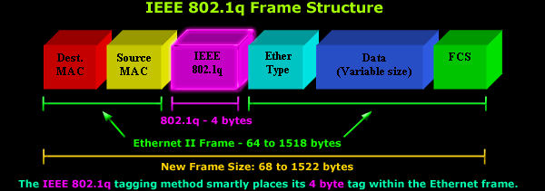

# Networking 

This page is dedicated to all my notes / research dedicated to learning the foundational concepts of computer networking. My intention with this page is to serve as a reference while working on my hypervisor and implementing new tools / technologies to make my setup more complex in what it can do.

# Autonegotiation 

Autonegotiation is a feature that allows a port on a router / server / switch / server to negotiate with the device on the other end of a link to determine the best duplex setting and speed. A driver then configures the interface to the values negotiated for the link. There are two parameters I mentioned before for negotiation. Those two being the speed and the duplex setting. 

Speeds are negotiated in Megabits per second ( Mbps ). in multiples of 10 ( 10 , 100 , 1000 , 10000).

Duplex determines how data flows on the device , half duplex means that only one side can trasmit data while the other cannot. Full duplex means that both sides can transmit & receive data at the same time.

There is a common misconception about autonegotiation, that being the misconception that autonegotiation configures the other host on the opposite side of the link. Autonegotiation only works if BOTH sides of the link are implementing autonegotiation. If both sides aren't using autonegotiate , then autonegotiate cannot determine the speed / duplex of the switch. 
If both sides are using autonegotiate , then one device advertises the speed / duplex to the other device on the link. The configuration is done on the hosts that have the feature enabled.

There is a common issue with autonegotiation being "parallel detection" which is enabled once autonegotiation fails to find autonegotiation running on the other side of the link.

Parallel detection works by sending a signal to the 10Base-T , 100Base-TX , 100Base-T4 drivers on the switch. If any of the drivers detect the signal , the interface is set to the speed mentioned on the signal. Keep in mind, parallel detection only changes the speed on the interface and **NOT** the duplex. You should keep this in mind as the way duplex is set differs based on the ethernet standard used.

## 10Base-T

Originally designed without full-duplex support. Some do , but most do not.

## 100Base-T

Has always had fully supported full-duplex however, by default however the standard will use half-duplex until set manually.  

## 1000Base-T 

This standard has more support for autonegotiation. In general links using this standard should be left to autonegotiate.

## 10 Gigabit 

Links using this standard are more dependent on fiber transcievers or specialized copper connectors which dictates how 10G connects. 

on a 6500 switch they usually require XENPAKS which only run at 10G.

---

When using 10Base-T & 100Base-T , after autonegotiation fails and activates the parallel detection feature, the driver sets the interface to half-duplex. 

When autonegotiation fails on a 10/100 link, you will commonly see the collisions counter increase on the half-duplex side due to one side being 10/100 half while the other side is 10/100 full. On the half-duplex side the TX side is monitoring the RX side. If a packets is being received on the RX side the TX will wait until the frame is processed before transmitting again. In this scenario if the network is busy the half-duplex side may not have the chance to trasmit any frames if the full-duplex side is constantly trasmitting. 

# Configuring Autonegotiation

On cisco switches, autonegotiation is enabled by default. In order to set the duplex first the link must have a set speed.

You may configure the duplex for a Cisco switch using the command below 

`(config-if)#duplex [half|full|auto] `

You may configure the speed using the command below 

`(config-if)#speed [10|100|1000|auto]`

---

# VLANS

VLANS are configured to virtually separate a switch into distinct LAN's that treat each VLAN as if it were connected to its own physical switch. In theory a frame intended for one VLAN should not be able to reach the other VLANS. However , there are exploits to get around this. 

There are two known exploits for circumventing the virtual separation of VLAN's on a switch. The type of attack is dubbed "VLAN Hopping" and there are two methods to achieve this. 

## Switch spoofing 

In a switch spoofing attack , an attacker imitates a trunking switch by using the tagging and trunking protocols used for maintaining the VLAN. I will put a link to the two most common protocols used at the bottom of this paragraph. 

[Multiple VLAN Registration Protocol](https://en.wikipedia.org/wiki/Multiple_VLAN_Registration_Protocol)

[IEEE 802.1Q](https://en.wikipedia.org/wiki/IEEE_802.1Q)

[Dynamic Trunking Protocol](https://en.wikipedia.org/wiki/Dynamic_Trunking_Protocol)

Attackers take advantage of default configurations for DTP. Any switch port configured as DTP auto will receive DTP packets generated by the attackers device. Once the DTP packet is received by the DTP configured port on the switch , it will be configured as a trunk port and accept traffic for any VLAN on the trunk. This would then allow the attacker to send packets to any VLAN on the negotiated trunk.

## Double Tagging

Double tagging allows an attacker to send a frame to a destination VLAN other than the source VLAN. In a scenario , the attacker is currently on VLAN 10 and sends a packet with the outer header being set to "VLAN 10". The frame is forwarded by the first switch as "VLAN 10" matches the trunk port associated. Once the packet hits the 2nd switch the second header is read as "VLAN 20" and forwarded through all ports matching the "VLAN 20" ID in the inner header.

---

# Connecting VLANS

In order for a host on VLAN 1 to forward frames to host2 on VLAN 2 , an external router may be used to accomplish this. To do this , the router must be connected to a port on each VLAN in order to facilitate communication.

However, as a networks scales to add more switches , there is another solution for interconnecting VLAN's. To do this , you may use trunking. VLAN trunks are links that carry traffic for more than one VLAN.

Trunk ports are not assigned a VLAN. If you want to route traffic between all the VLAN's , you can use a "router-on-a-stick" approach , to do this you would connect a router to a trunk port on the switch. The only limitation with this setup is the bandwidth on the trunk port used. Often the port may be a 10 Mbps link which isn't optimal. Sometimes you will see a similar approach except instead of router you would use a firewall. Keep in mind this approach only applies to Layer 2 switches, layer 3 switches have a router built in which you could use to route traffic between all VLAN's.   

---

# Configuring VLAN's 

Some Cisco switch models like the 2950 and the 3550 come equiped with a VLAN database which has an entirely separate configuration than the switch. This was an older feature on Cisco switches. However newer models allow you to manage the VLAN's from the CLI 

---

# Trunking 

A trunk is an interface or link that can carry frames for more than one VLAN. Trunks are used to facilitate communication between two devices in the same VLAN on anoother switche. They can act as a metaphorical bridge to another switch's ports in the same VLAN. Trunking is not related to purely switches and can even be setup on routers / firewalls and other devices. 

When a switch receives a frame from a trunk port , it views the reference to the intended VLAN. This reference is stored in a header utilizing the Inter Switch Link( ISL) or 802.1Q protocol. Some swithes may not support the ISL protocol and may have to use the 802.1Q protocol. 

There are some differences between the two protocols and how they treat the ethernet frame. ISL encapsulates frames inside it's own ISL fram while 802.1Q alters the ethernet frame and adds a VLAN tag header 

You can see a picture of a 802.1Q frame below 

