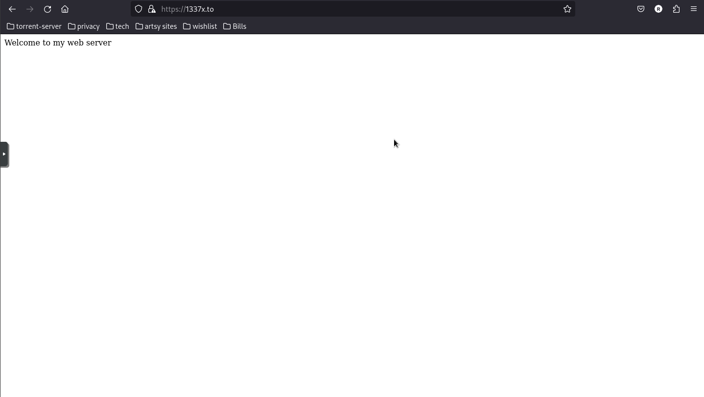

# Troubleshooting 

This page is dedicated to issues or problems I have to troubleshoot, this is a very brand new page which might not have alot of information at this time of writing 9/19/2024. However I will try to keep this page updated as new issues arise. I will use the template issue at the bottom of this page to line out the formatting for each individual issue.

---

## DNS Issues 

**1337x.to redirects to blank page with "welcome to my web server"**

Below is a picture of the issue 

### Description :

Navigating to the https://1337x.to navigates to a blank page with only the text " Welcome to my web server " showing. Almost. This looks similar to a default web page setup for a server. It's possible the adguard home service is blocking certain content from the page and the website is redirecting me to a blank page for doing so.

## Notes 

* Checked for the url on the blocked URL's in the filter for adguard home , removed the blocked URL's for

---

# =======  START OF TEMPLATE =======  

## Template issue header 

**sub issue header**

TEXT HERE FOR TEMPLATE 

## Description : 

TEMPLATE TEXT HERE FOR THE ISSUE 

# =======  END OF TEMPLATE =======  

